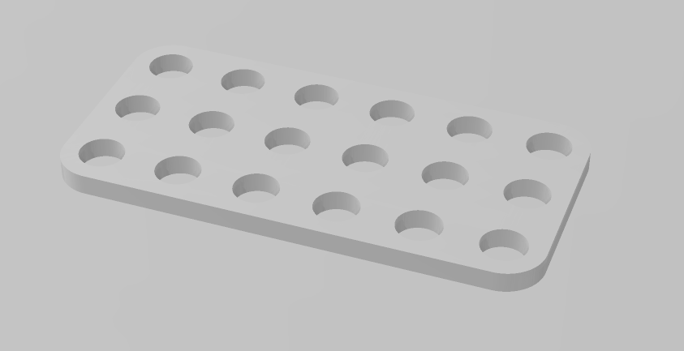
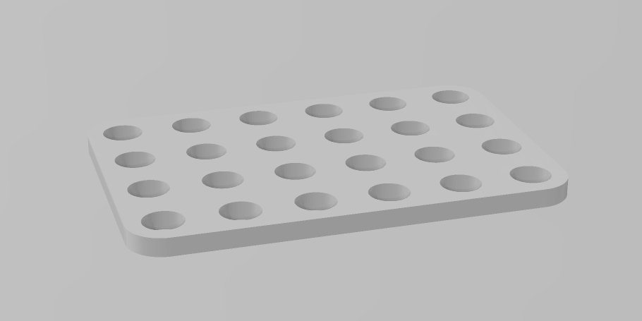
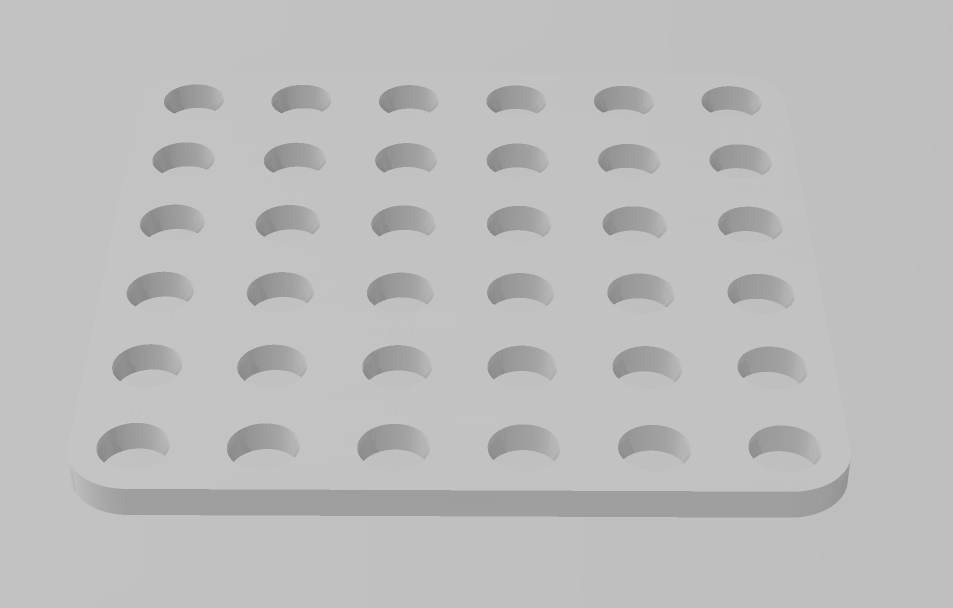
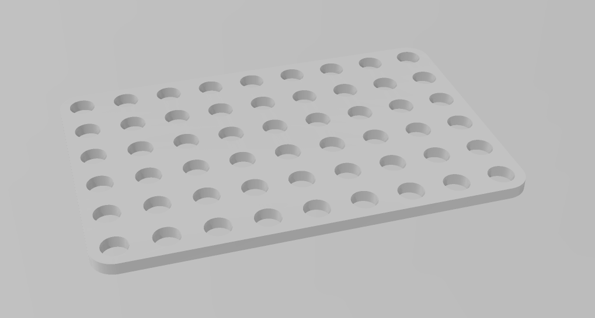
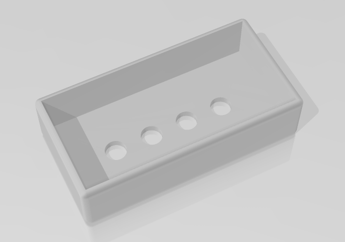

# ORIGEN DEL PROYECTO

ESTE PROYECTO ES UNA ADAPTACION DEL COMPRADO EN Aliexpres

PODEIS VER EN     
https://es.aliexpress.com/item/1005006649112925.html?spm=a2g0o.order_list.order_list_main.84.4901194dXhFraZ&gatewayAdapt=glo2esp

# Stemfie-proyectos
 proyectos realizados con piezas Semfie. https://www.stemfie.org/  
  
  
 |         |       
------------- | ------------- | ------------- 
 

# PIEZAS UTILIZADAS
  
Descripción         | Imagen         | Archivo   | Cantidad         
------------- | ------------- | ------------- | ------------- 
base 6x3 | | [base 6x3](Archivos_STL/base 6x3.stl) | 1
base 6x4 | | [base 6x4](Archivos_STL/base 6x4.stl) | 1
base 6x6 | | [base 6x6](Archivos_STL/base 6x6.stl) | 1
base 6x9 | | [base 6x9](Archivos_STL/base 6x9.stl) | 1

Caja Bateria | | [Caja Baterias](Archivos_STL/cajabaterias.stl) | 1

Beam STR ESS BU03x01x01 | | [Beam STR ESS BU03x01x01](Archivos_STL/Beam3.stl) | 2
Brace STR STD ERR BU06x01x00.25 - SPN-BRC-0005 | | [Brace STR STD ERR BU06x01x00.25 - SPN-BRC-0005](Archivos_STL/Brace6.stl) | 2
Beam STR ESS ERHRH DE BU03x01x01 - SPN-BEM-0802 | | [Beam STR ESS ERHRH DE BU03x01x01 - SPN-BEM-0802](Archivos_STL/Beam3_Ros.stl) | 1
Pin SPP INR LCT BDR BU01.00x00.50 - SPN-PIN-0094 | | [Pin SPP INR LCT BDR BU01.00x00.50 - SPN-PIN-0094](Archivos_STL/PIN-0094.stl) | 1

Screw FL-RH RHD BU00.50 - SPN-SCR-0082 | | [Screw FL-RH RHD BU00.50 - SPN-SCR-0082](Archivos_STL/SCR-0082.stl) | 6
Screw FL-RH RHD BU01.25 - SPN-SCR-0085 | | [Screw FL-RH RHD BU01.25 - SPN-SCR-0085](Archivos_STL/SCR-0085.stl) | 1
Washer FRE BU01.00x00.25 - SPN-WSR-0038 | | [Washer FRE BU01.00x00.25 - SPN-WSR-0038](Archivos_STL/Washer_FREE.stl) | 10
Spacer FXD BU01.00x00.25 - SPN-SPR-0004 | | [Spacer FXD BU01.00x00.25 - SPN-SPR-0004](Archivos_STL/Spacer.stl) | 5
Nut RH BU01.00x5mm - SPN-NUT-0001 | | [Nut RH BU01.00x5mm - SPN-NUT-0001](Archivos_STL/Nut_Ros.stl) | 5
Nut PH CL BU01.00x5mm - SPN-NUT-0018 | | [Nut PH CL BU01.00x5mm - SPN-NUT-0018](Archivos_STL/Nut_90.stl) | 5

# Portabaterias 2 AA con interruptor 

# MONTAJE

 
   

  
  

