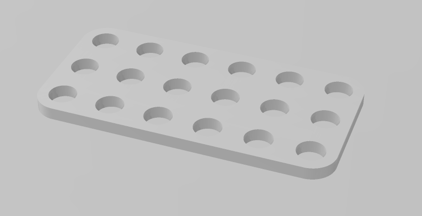
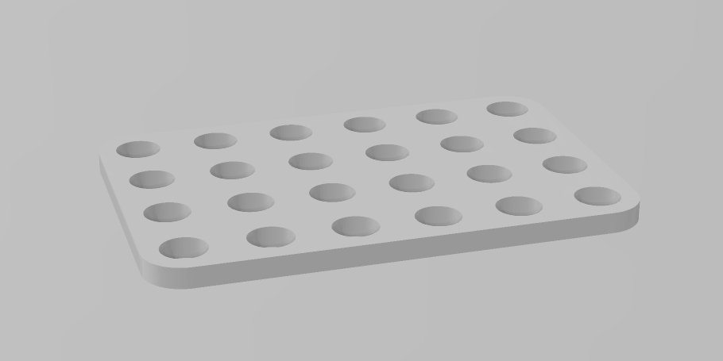
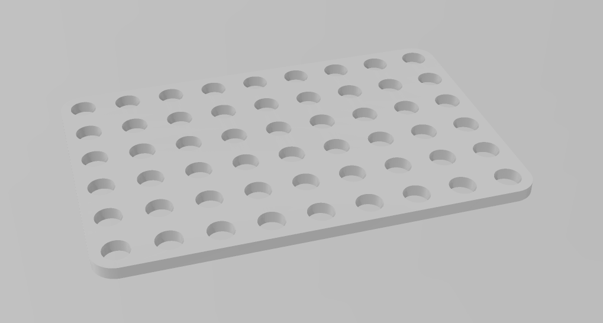
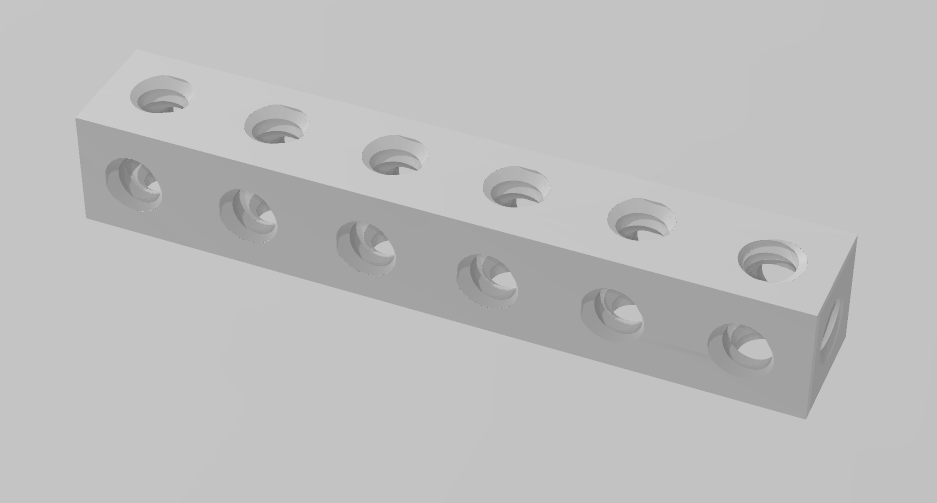
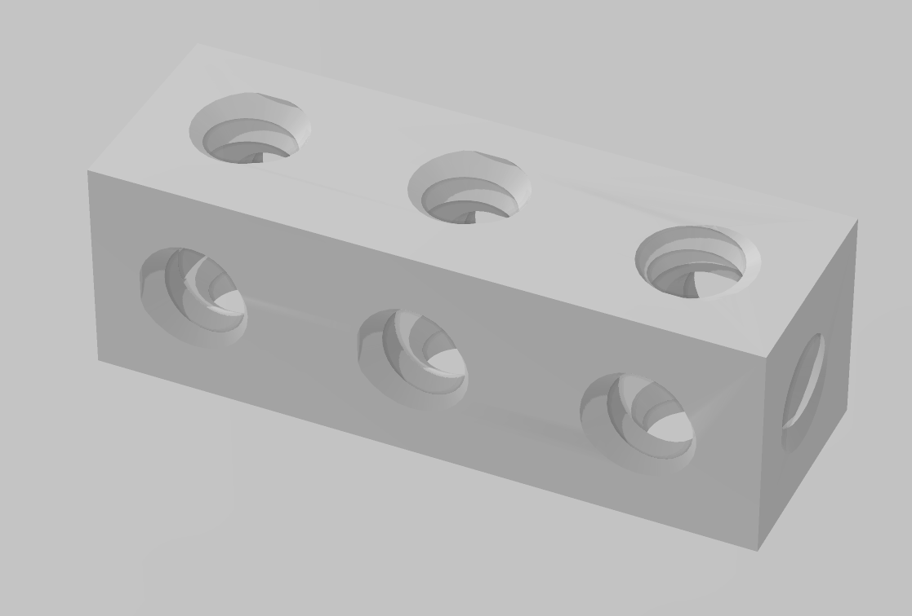
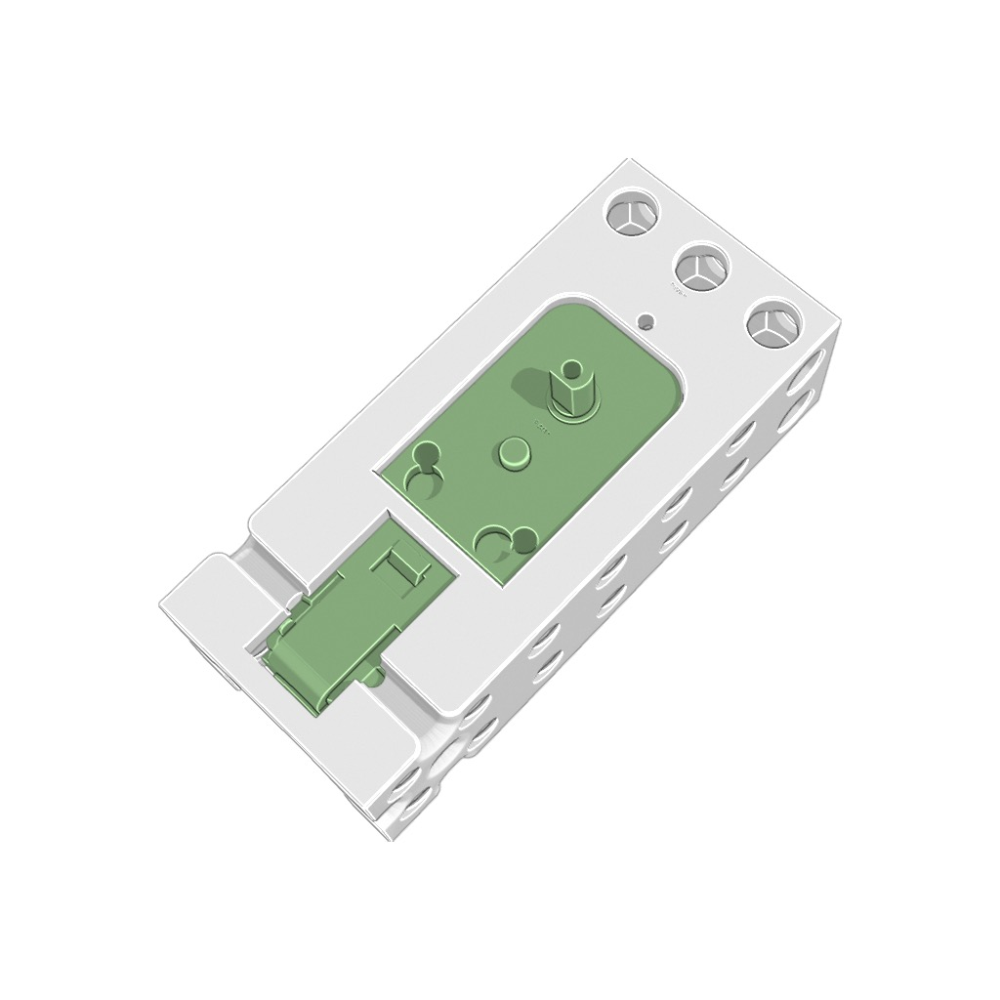
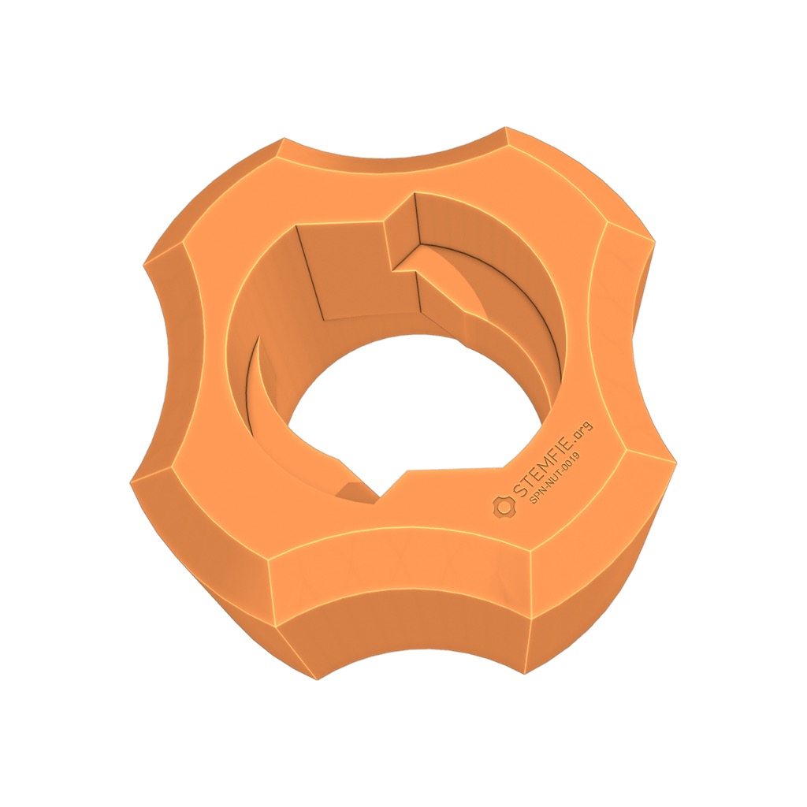
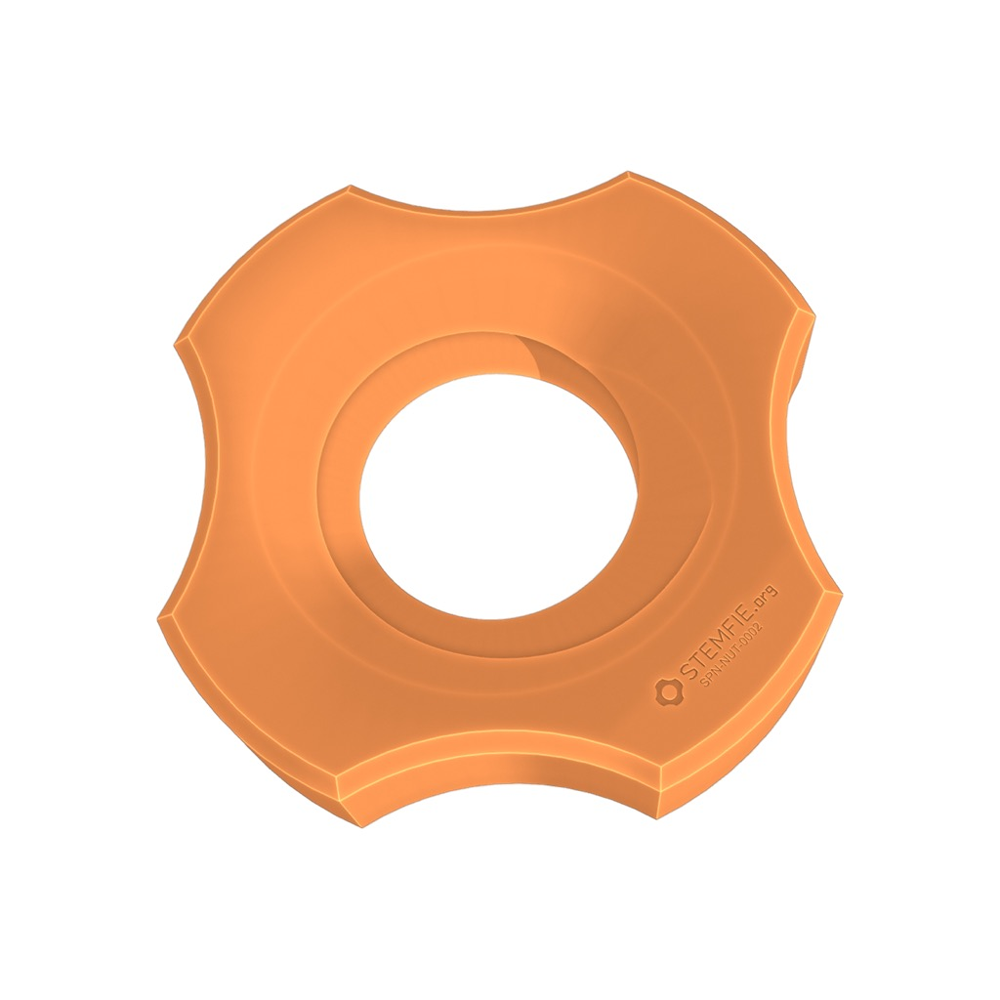
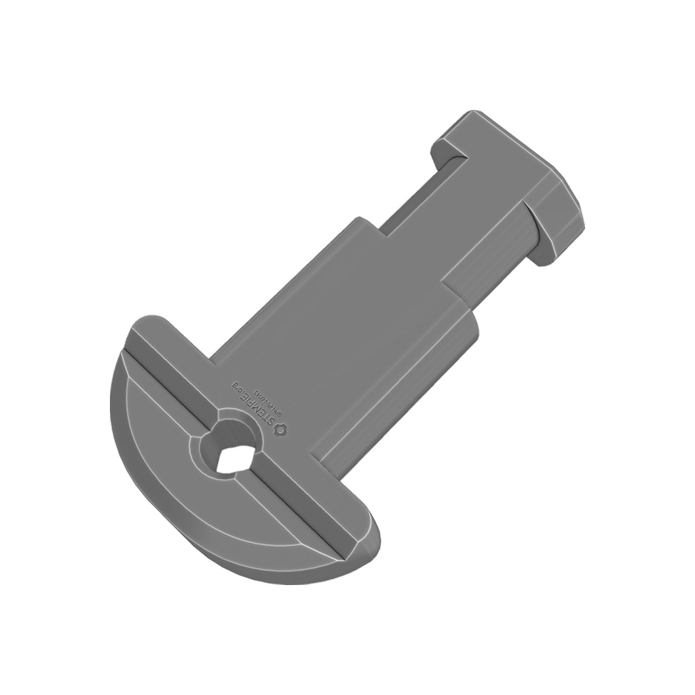
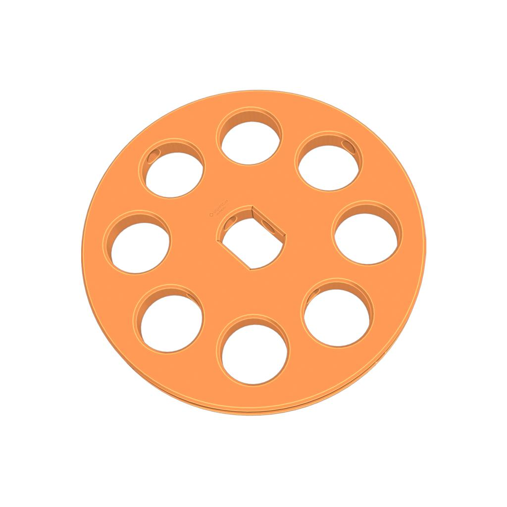

# ORIGEN DEL PROYECTO

ESTE PROYECTO ES UNA ADAPTACION DEL COMPRADO EN Aliexpres

PODEIS VER EN     
https://es.aliexpress.com/item/1005006649112925.html?spm=a2g0o.order_list.order_list_main.84.4901194dXhFraZ&gatewayAdapt=glo2esp

# Stemfie-proyectos
 proyectos realizados con piezas Semfie. https://www.stemfie.org/  
  
  
 |         |       
------------- | ------------- | ------------- 

# PIEZAS UTILIZADAS
  
Descripción         | Imagen         | Archivo   | Cantidad         
------------- | ------------- | ------------- | ------------- 
base 6x3                           |         | [base 6x3](Archivos_STL/base_6x3.stl) | 1
base 6x4                           |         | [base 6x4](Archivos_STL/base_6x4.stl) | 4
base 6x6                           |         | [base 6x6](Archivos_STL/base_6x6.stl) | 5
base 6x9                           |         | [base 6x9](Archivos_STL/base_6x9.stl) | 1
Beam STR ROSCADO 6                   |    | [Beam STR ROSCADO](Archivos_STL/Beam_Roscado_6.stl) | 5
Beam STR ROSCADO 3                   |    | [Beam STR ROSCADO](Archivos_STL/Beam_Roscado_3.stl) | 2
Bracket ELC MTR [for TT Motor SPN-NPH-0006]                         |        | [Porta_Motor_TT](Archivos_STL/Porta_Motor_TT.3mf) | 1
Nut PH CL BU01.00x00.25 - SPN-NUT-0019                              |  | [Tuerca_Bloqueo_0.25](Archivos_STL/Tuerca_Bloqueo_0.25.3mf) | 2
Nut RH BU01.00x00.25 - SPN-NUT-0002                                 |  | [Tuerca_Roscada_0.25](Archivos_STL/Tuerca_Roscada_0.25.3mf) | 8
Pin CL RHD BU00.75 - SPN-PIN-0043 (stemfie.org) [4 mm]              |          | [Pin_BU00.75](Archivos_STL/Pin_BU00.75.3mf) | 2
Retaining Ring SFT LCT RDL TRH-H ASYM BU01.00x01.25 - SPR-RRG-0001  |  | [Retaining_Ring_BU01.00x01.25-SPR-RRG-0001](Archivos_STL/Retaining_Ring_BU01.00x01.25-SPR-RRG-0001.3mf) | 10
Washer FXD OCT BU03.00x00.25 - SPN-WSR-0009                         |  | [Ruedas_SPN-WSR-0009](Archivos_STL/Ruedas_SPN-WSR-0009.3mf) | 2

CAMBIAR                        |        | [CAMBIAR](Archivos_STL/CAMBIAR.3mf) | 1
CAMBIAR                        |        | [CAMBIAR](Archivos_STL/CAMBIAR.3mf) | 1
CAMBIAR                        |        | [CAMBIAR](Archivos_STL/CAMBIAR.3mf) | 1
CAMBIAR                        |        | [CAMBIAR](Archivos_STL/CAMBIAR.3mf) | 1
CAMBIAR                        |        | [CAMBIAR](Archivos_STL/CAMBIAR.3mf) | 1
CAMBIAR                        |        | [CAMBIAR](Archivos_STL/CAMBIAR.3mf) | 1
CAMBIAR                        |        | [CAMBIAR](Archivos_STL/CAMBIAR.3mf) | 1
CAMBIAR                        |        | [CAMBIAR](Archivos_STL/CAMBIAR.3mf) | 1
CAMBIAR                        |        | [CAMBIAR](Archivos_STL/CAMBIAR.3mf) | 1
CAMBIAR                        |        | [CAMBIAR](Archivos_STL/CAMBIAR.3mf) | 1
CAMBIAR                        |        | [CAMBIAR](Archivos_STL/CAMBIAR.3mf) | 1

33 tornillos de 0.5

# Portabaterias 2 AA con interruptor 

# MONTAJE

 
   

  
  

