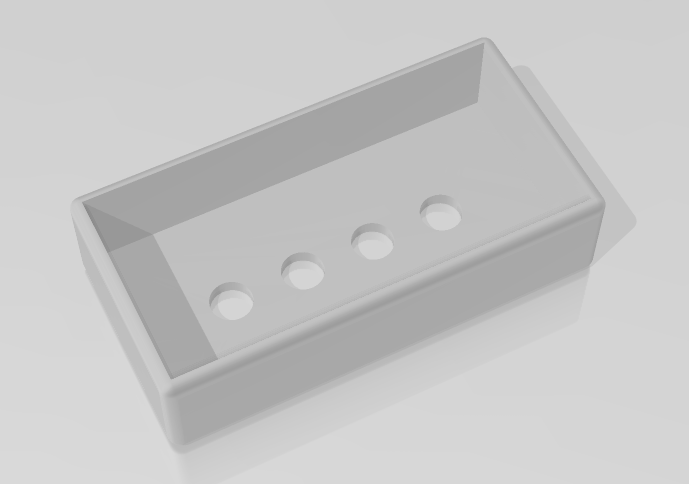
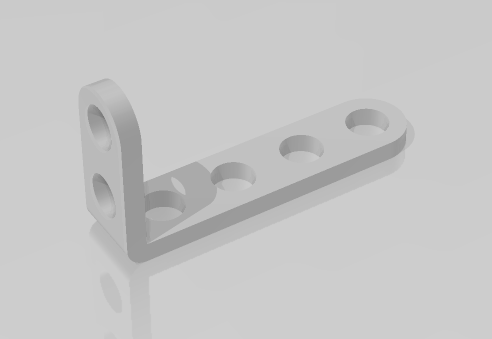

# Stemfie-proyectos
 proyectos realizados con piezas Semfie. https://www.stemfie.org/  
  
  

## Suports 3D
  
Descripción         | Imagen         | Archivo         
------------- | ------------- | ------------- 
Caja Bateria | | [Caja Baterias](Archivos_STL/cajabaterias.stl)
pata caminante | | [pata caminante](Archivos STL/pata caminante.stl)
Motor DC TT L | | [Motor DC TT L](Archivos STL/Motor DC TT L.stl)
Motor DC TT R | | [Motor DC TT R](Archivos STL/Motor DC TT R.stl)
Beam STR ESS BU03x01x01 | | [Beam STR ESS BU03x01x01](Archivos STL/Beam STR ESS BU03x01x01 - SPN-BEM-0040.stl)
Brace STR STD ERR BU06x01x00.25 - SPN-BRC-0005 | | [Brace STR STD ERR BU06x01x00.25 - SPN-BRC-0005](Archivos STL/Brace STR STD ERR BU06x01x00.25 - SPN-BRC-0005.stl)
Beam STR ESS ERHRH DE BU03x01x01 - SPN-BEM-0802 | | [Beam STR ESS ERHRH DE BU03x01x01 - SPN-BEM-0802](Archivos STL/Beam STR ESS ERHRH DE BU03x01x01 - SPN-BEM-0802.stl)
Pin SPP INR LCT BDR BU01.00x00.50 - SPN-PIN-0094 | | [Pin SPP INR LCT BDR BU01.00x00.50 - SPN-PIN-0094](Archivos STL/Pin SPP INR LCT BDR BU01.00x00.50 - SPN-PIN-0094.stl)
Wheel GND TTRD FRE BU03.00x01.00 - SPN-WHL-0001 | | [Wheel GND TTRD FRE BU03.00x01.00 - SPN-WHL-0001](Archivos STL/Wheel GND TTRD FRE BU03.00x01.00 - SPN-WHL-0001.stl)
Screw FL-RH RHD BU00.50 - SPN-SCR-0082 | | [Screw FL-RH RHD BU00.50 - SPN-SCR-0082](Archivos STL/Screw FL-RH RHD BU00.50 - SPN-SCR-0082.stl)
Screw FL-RH RHD BU01.25 - SPN-SCR-0085 | | [Screw FL-RH RHD BU01.25 - SPN-SCR-0085](Archivos STL/Screw FL-RH RHD BU01.25 - SPN-SCR-0085.stl)
Washer FRE BU01.00x00.25 - SPN-WSR-0038 | | [Washer FRE BU01.00x00.25 - SPN-WSR-0038](Archivos STL/Washer FRE BU01.00x00.25 - SPN-WSR-0038.stl)
Spacer FXD BU01.00x00.25 - SPN-SPR-0004 | | [Spacer FXD BU01.00x00.25 - SPN-SPR-0004](Archivos STL/Spacer FXD BU01.00x00.25 - SPN-SPR-0004.stl)
Nut RH BU01.00x5mm - SPN-NUT-0001 | | [Nut RH BU01.00x5mm - SPN-NUT-0001](Archivos STL/Nut RH BU01.00x5mm - SPN-NUT-0001.stl)
Nut PH CL BU01.00x5mm - SPN-NUT-0018 | | [Nut PH CL BU01.00x5mm - SPN-NUT-0018](Archivos STL/Nut PH CL BU01.00x5mm - SPN-NUT-0018.stl)
abrazadera para motor TT-V2 | | [abrazadera para motor TT-V2](Archivos STL/abrazadera para motor TT-V2.stl)
Brace STR SLT SE ERR BU08x01x00.25x03 - SPN-BRC-0138| | [Brace STR SLT SE ERR BU08x01x00.25x03 - SPN-BRC-0138](Archivos STL/Brace STR SLT SE ERR BU08x01x00.25x03 - SPN-BRC-0138.stl)
Screw FL-RH RHD BU00.50 - SPN-SCR-0082 | | [Screw FL-RH RHD BU00.50 - SPN-SCR-0082](Archivos STL/Screw FL-RH RHD BU00.50 - SPN-SCR-0082.stl)
Screw FL-RH RHD BU01.25 - SPN-SCR-0085 | | [Screw FL-RH RHD BU01.25 - SPN-SCR-0085](Archivos STL/Screw FL-RH RHD BU01.25 - SPN-SCR-0085.stl)

