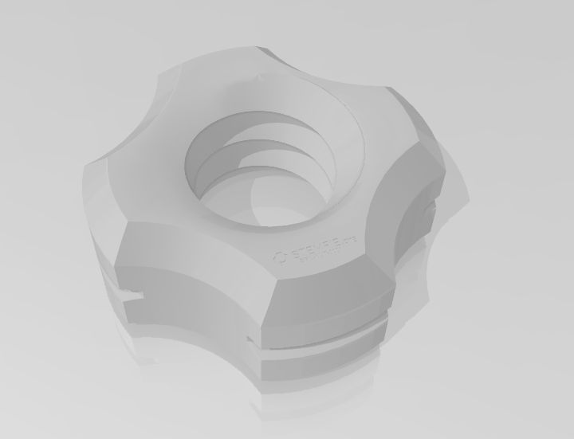

# ORIGEN DEL PROTECTO

ESTE PROYECTO ES UNA ADAPTACION DEL DE STEM Inventions, REALIZADO EN CORTE LASER.

PODEIS VER EN     https://www.youtube.com/watch?v=TDdahxxYM7Q

# Stemfie-proyectos
 proyectos realizados con piezas Semfie. https://www.stemfie.org/  
  
  
  
 

# PIEZAS UTILIZADAS
  
Descripción         | Imagen         | Archivo   | Cantidad         
------------- | ------------- | ------------- | ------------- 
Caja Bateria | | [Caja Baterias](Archivos_STL/cajabaterias.stl) | 1
pata caminante | | [pata caminante](Archivos_STL/pata_caminante.stl) | 2
Motor DC TT L | | [Motor DC TT L](Archivos_STL/Motor_DC_TT_L.stl) | 1
Motor DC TT R | | [Motor DC TT R](Archivos_STL/Motor_DC_TT_R.stl) | 1
Beam STR ESS BU03x01x01 | | [Beam STR ESS BU03x01x01](Archivos_STL/Beam3.stl) | 2
Brace STR STD ERR BU06x01x00.25 - SPN-BRC-0005 | | [Brace STR STD ERR BU06x01x00.25 - SPN-BRC-0005](Archivos_STL/Brace6.stl) | 2
Beam STR ESS ERHRH DE BU03x01x01 - SPN-BEM-0802 | | [Beam STR ESS ERHRH DE BU03x01x01 - SPN-BEM-0802](Archivos_STL/Beam3_Ros.stl) | 1
Pin SPP INR LCT BDR BU01.00x00.50 - SPN-PIN-0094 | | [Pin SPP INR LCT BDR BU01.00x00.50 - SPN-PIN-0094](Archivos_STL/PIN-0094.stl) | 1
Wheel GND TTRD FRE BU03.00x01.00 - SPN-WHL-0001 | | [Wheel GND TTRD FRE BU03.00x01.00 - SPN-WHL-0001](Archivos_STL/Wheel.stl) | 2
Screw FL-RH RHD BU00.50 - SPN-SCR-0082 | | [Screw FL-RH RHD BU00.50 - SPN-SCR-0082](Archivos_STL/SCR-0082.stl) | 6
Screw FL-RH RHD BU01.25 - SPN-SCR-0085 | | [Screw FL-RH RHD BU01.25 - SPN-SCR-0085](Archivos_STL/SCR-0085.stl) | 1
Washer FRE BU01.00x00.25 - SPN-WSR-0038 | | [Washer FRE BU01.00x00.25 - SPN-WSR-0038](Archivos_STL/Washer_FREE.stl) | 10
Spacer FXD BU01.00x00.25 - SPN-SPR-0004 | | [Spacer FXD BU01.00x00.25 - SPN-SPR-0004](Archivos_STL/Spacer.stl) | 5
Nut RH BU01.00x5mm - SPN-NUT-0001 | | [Nut RH BU01.00x5mm - SPN-NUT-0001](Archivos_STL/Nut_Ros.stl) | 5
Nut PH CL BU01.00x5mm - SPN-NUT-0018 | | [Nut PH CL BU01.00x5mm - SPN-NUT-0018](Archivos_STL/Nut_90.stl) | 5
abrazadera para motor TT-V2 | | [abrazadera para motor TT-V2](Archivos_STL/abrazadera_V2.stl) | 1
Brace STR SLT SE ERR BU08x01x00.25x03 - SPN-BRC-0138| | [Brace STR SLT SE ERR BU08x01x00.25x03 - SPN-BRC-0138](Archivos_STL/Brace5_3.stl) | 2
Pin CL RHD BU05.50 - SPN-PIN-0062| | [Pin CL RHD BU05.50 - SPN-PIN-0062](Archivos_STL/PIN-0062.stl) | 1
Pin_Motor_Carretilla| | [Pin_Motor_Carretilla](Archivos_STL/Pin_Motor_Carretilla.stl) | 2
Pin CL RHD BU03.50 - SPN-PIN-0054)| | [Pin CL RHD BU03.50 - SPN-PIN-0054](Archivos_STL/PIN-0054.stl) | 1

# MONTAJE

   

  
  

