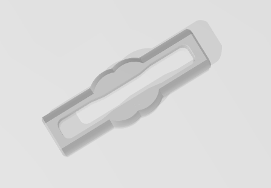
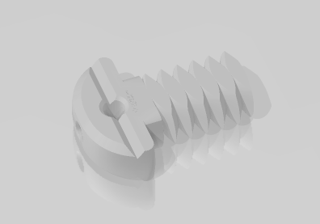
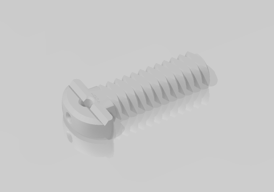
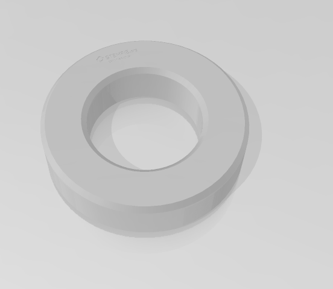
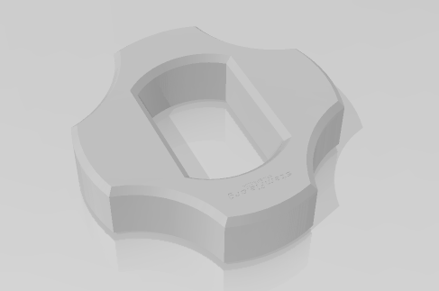
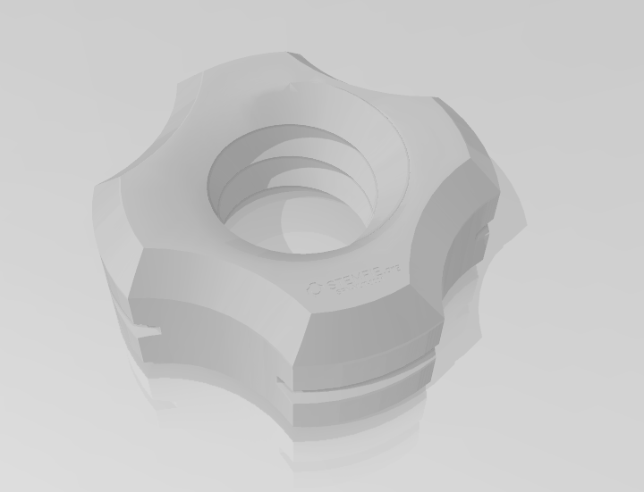
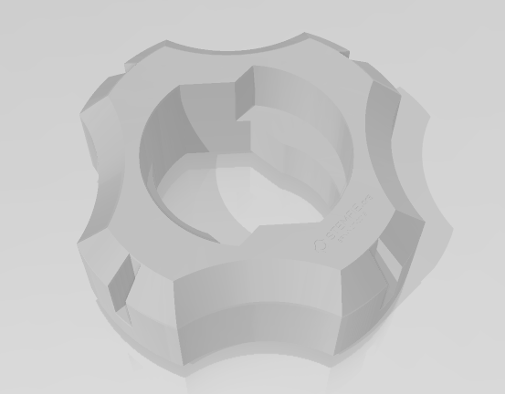

## Stemfie-proyectos
 proyectos realizados con piezas Semfie. https://www.stemfie.org/  
  
 

## Suports 3D
  
Descripción         | Imagen         | Archivo         
------------- | ------------- | ------------- 
Caja Bateria | | [Caja Baterias](Archivos_STL/cajabaterias.stl)
Motor DC TT L | | [Motor DC TT L](Archivos_STL/Motor_DC_TT_L.stl)
Motor DC TT R | | [Motor DC TT R](Archivos_STL/Motor_DC_TT_R.stl)
Beam STR ESS BU03x01x01 | | [Beam STR ESS BU03x01x01](Archivos_STL/Beam3.stl)
Beam STR ESS ERHRH DE BU03x01x01 - SPN-BEM-0802 | | [Beam STR ESS ERHRH DE BU03x01x01 - SPN-BEM-0802](Archivos_STL/Beam3_Ros.stl)
Pin SPP INR LCT BDR BU01.00x00.50 - SPN-PIN-0094 | | [Pin SPP INR LCT BDR BU01.00x00.50 - SPN-PIN-0094](Archivos_STL/PIN-0094.stl)
Screw FL-RH RHD BU00.50 - SPN-SCR-0082 | | [Screw FL-RH RHD BU00.50 - SPN-SCR-0082](Archivos_STL/SCR-0082.stl)
Screw FL-RH RHD BU01.25 - SPN-SCR-0085 | | [Screw FL-RH RHD BU01.25 - SPN-SCR-0085](Archivos_STL/SCR-0085.stl)
Washer FRE BU01.00x00.25 - SPN-WSR-0038 | | [Washer FRE BU01.00x00.25 - SPN-WSR-0038](Archivos_STL/Washer_FREE.stl)
Spacer FXD BU01.00x00.25 - SPN-SPR-0004 | | [Spacer FXD BU01.00x00.25 - SPN-SPR-0004](Archivos_STL/Spacer.stl)
Nut RH BU01.00x5mm - SPN-NUT-0001 | | [Nut RH BU01.00x5mm - SPN-NUT-0001](Archivos_STL/Nut_Ros.stl)
Nut PH CL BU01.00x5mm - SPN-NUT-0018 | | [Nut PH CL BU01.00x5mm - SPN-NUT-0018](Archivos_STL/Nut_90.stl)

